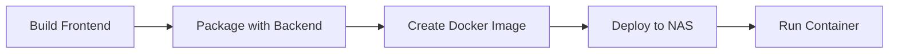

# Roon AI Extension Instructions

## Functional Overview

### AI Playlist Generation
- AI Search button will allow the user to input information into a search field in a popup dialog
- Use natural language prompts to generate track lists using this search field
  - Text input directly in search field
  - Voice input via recording button
    - Click microphone icon to start recording
    - Visual indicator shows recording status
    - Recording automatically stops after silence or manual stop
    - Audio is transcribed and populated into search field
    - User can edit transcribed text before submitting
- The AI understands musical concepts, genres, moods, and contexts
- Generated tracks are automatically located in your Roon library
- Tracks are queued for playback once found

### Track Information
- Press the Track Info button while a track is playing to get detailed AI-generated information
- Information includes musical analysis, historical context, and interesting facts
- Natural language responses provide rich, contextual details about the music

## Infrastructure

### Yarn Monorepo Structure
```
roon-web-stack/
├── app/                      # Application packages
│   ├── roon-web-api/        # Backend Node.js API
│   └── roon-web-ng-client/  # Frontend Angular app
├── packages/                 # Shared library packages
│   ├── roon-web-client/     # TypeScript client library
│   └── roon-web-model/      # Shared types and interfaces
├── scripts/                 # Build and deployment scripts
├── package.json            # Root package configuration
└── yarn.lock              # Yarn dependency lock file
```

### Workspace Configuration
The monorepo uses Yarn workspaces to manage multiple packages:
```json
{
  "workspaces": [
    "packages/*",
    "app/*"
  ]
}
```

### Architecture Overview
This monorepo contains:
- A Node.js backend API that interfaces with Roon
- An Angular frontend client
- Shared packages for the client/server communication
- Docker deployment configuration

#### Backend API (`app/roon-web-api`)
- CQRS-based HTTP proxy for the Roon API
- Built with Fastify for performance
- Handles all Roon server communication
- Manages single connection point for multiple web clients
- Broadcasts events for zones, outputs, and queues

#### Frontend Client (`app/roon-web-ng-client`)
- Angular 19 application
- Material UI components
- Responsive design for mobile/desktop
- Real-time updates via event subscriptions

#### Runtime Architecture
- Docker container runs with host networking for Roon discovery
- Backend serves both the API and static frontend files
- Environment configuration via `.env` file
- Persistent storage for Roon configuration
- Real-time event broadcasting for state updates

## Development

### Setup
1. Install dependencies (uses Yarn workspaces):
   ```bash
   yarn install
   ```
2. Build all workspaces:
   ```bash
   yarn build
   ```

### Running Locally
To launch the backend workspace in watch mode:
```bash
yarn backend
```

To launch the frontend workspace in watch mode:
```bash
yarn frontend
```

### Available Workspace Commands
```bash
yarn lint       # lint every workspace in dependency order
yarn lint:fix   # lint and auto-fix every workspace
yarn build      # build every workspace in dependency order
yarn test      # test every workspace in dependency order
```

## Deployment

### Building for NAS
1. Build the Docker image for AMD64 architecture:
   ```bash
   ./scripts/build-nas-image.sh
   ```
   This will:
   - Build the frontend Angular app
   - Package it with the backend
   - Create a Docker image
   - Save the image as roon-backend.tar

### Deploying to NAS
1. Create a `.env` file with your NAS credentials:
   ```
   NAS_HOST=192.168.0.14
   NAS_USER=your_username
   ROOT_PASSWORD=your_password
   ```

2. Deploy to NAS:
   ```bash
   ./scripts/deploy-nas.sh
   ```
   This will:
   - Copy the tar file to the NAS
   - Load the Docker image
   - Start the container

### Deployment Flow


## Notes
- AI responses may vary based on the complexity of the prompt
- Track availability depends on your Roon library
- Internet connection required for AI features

## Technical Implementation Details

### Voice Input Feature
```typescript
// Component Structure
app/roon-web-ng-client/
├── components/
│   └── ai-search/
│       ├── ai-search.component.ts     # Main dialog component
│       ├── voice-recorder.component.ts # Recording handling
│       └── voice-indicator.component.ts # Recording status UI
```

#### Recording Flow
1. User clicks microphone icon in search dialog
2. Browser requests microphone permission if not already granted
3. Visual indicator shows active recording status
4. Audio is recorded using Web Audio API
5. Recording stops on:
   - Silence detection (>2 seconds)
   - Manual stop button
   - Maximum duration (30 seconds)
6. Audio is sent to backend for transcription
7. Transcribed text appears in search field

#### Backend Processing
- Audio is transcribed using OpenAI Whisper API
- Transcription is returned to frontend
- Original audio is discarded after transcription
