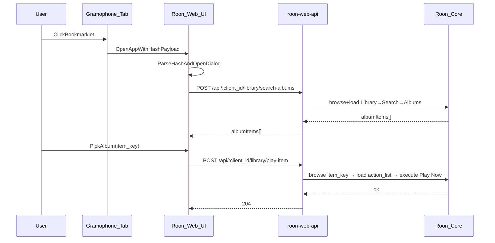

# Gramophone URL → Roon “Play Now” (Bookmarklet Spec)

## Summary
This feature lets a Gramophone reader open an article in a normal browser tab
(logged in, paywall satisfied), click a **bookmarklet**, and then pick the
matching album in Roon to **Play Now** in the currently displayed zone.

This avoids persisting Gramophone credentials/cookies on a remote
`roon-web-api` host.

Reference example article:
`https://www.gramophone.co.uk/features/article/haydn-in-london`

## Goals
- **Paste/click from Gramophone while reading**: read the article while
  starting playback of the recording in Roon.
- **No Gramophone secrets stored**: no username/password, no cookie import
  required.
- **Play Now** in the **current displayed zone**.
- **Ambiguity is user-resolved**: show a pick list of candidate albums.

## Non-goals (initial)
- Perfect, fully automatic identification of a single “correct” album.
- Server-side paywall scraping.
- Supporting non-Gramophone sites (can extend later).

## User flow
1. User opens a Gramophone article in a separate tab and signs in normally.
2. User clicks the “Roon Web: Send Gramophone page” bookmarklet.
3. Bookmarklet opens the Roon Web app in a new tab (or focuses it) with a
   payload embedded in the URL hash.
4. Roon Web parses the payload and opens a **Share from Gramophone** dialog.
5. Dialog proposes a search query (selection/title/description), calls the API
   to search albums, and displays candidates.
6. User selects an album → app calls API to execute **Play Now** in the
   currently displayed zone.

## Architecture



## Bookmarklet specification

### Payload model
The bookmarklet extracts the following:
- **url**: `location.href`
- **title**: `meta[property="og:title"] || document.title`
- **description**: `meta[name="description"]`
- **selection** (optional but preferred): `window.getSelection().toString()`

### Transfer mechanism
- Open the app with payload in the URL hash:
  - `https://<roon-web-host>/#gramophone=<urlencoded-json>`
- Rationale: hash is not sent to server by default, and is easy to parse.

### Validation rules (client)
- Accept only payloads with a URL host matching `gramophone.co.uk` (initial).
- Reject (and show error dialog) if JSON parsing fails or required fields are
  absent.
- Clear the hash after ingest (use `history.replaceState`) to prevent re-run on
  refresh.

### Query precedence
Default search query (editable by user):
1. `selection` if non-empty
2. `title`
3. `title + " " + description`

## Roon integration behavior
- The action performed is **Play Now** (per product decision).
- The zone is the app’s **currently displayed zone** (from
  `SettingsService.displayedZoneId()`).
- If the API cannot find a suitable “Play Now” action, return an error; UI
  shows a message and keeps the pick list.

## API changes (roon-web-api)
Add endpoints (names are intentionally generic; not Gramophone-specific) in
`app/roon-web-api/src/route/api-route.ts`:

### `POST /api/:client_id/library/search-albums`
- **Body**: `{ zoneId: string; query: string }`
- **Response**:
  - `{ items: { title: string; subtitle?: string; item_key: string; image_key?: string }[] }`
- **Implementation**:
  - reuse library browse helpers in
    `app/roon-web-api/src/service/roon-utils.ts`:
    - `browseIntoLibrary`
    - `getLibrarySearchItem`
    - navigate `Library → Search → Albums`

### `POST /api/:client_id/library/play-item`
- **Body**: `{ zoneId: string; item_key: string; actionTitle: "Play Now" }`
- **Response**: `204`
- **Implementation**:
  - reuse the established “load action list and execute action” approach from
    `playAlbumTrack` in
    `app/roon-web-api/src/service/client-tracks-manager.ts`

## Client library changes (`packages/roon-web-client`)
Extend `packages/roon-web-client/src/client/roon-web-client-factory.ts` with:
- `searchAlbums(zoneId, query)`
- `playItem(zoneId, item_key, actionTitle)`

## Angular changes (roon-web-ng-client)

### Entry point / hash ingestion
Add a small service (or logic in `NrRootComponent`) that:
- reads `window.location.hash`
- parses `#gramophone=...`
- opens a dialog via `DialogService`
- clears hash

### Share dialog UI
New component:
- `app/roon-web-ng-client/src/app/components/gramophone-share-dialog/*`

Dialog requirements:
- show extracted URL/title
- editable query field
- results list of albums (cover + title + subtitle)
- “Play Now” button per result
- error handling for empty results / API errors

### Worker plumbing
Add request/response types and worker handling similar to existing `play-tracks`
flow:
- `app/roon-web-ng-client/src/app/model/worker.model.ts`
- `app/roon-web-ng-client/src/app/services/roon.worker.ts`
- `app/roon-web-ng-client/src/app/services/roon.service.ts`

## Testing
- **Backend Jest**:
  - `search-albums` navigates browse/load correctly
  - `play-item` executes the correct action chain
- **Angular Jest**:
  - hash parsing + dialog open + hash clearing
  - dialog behaviors (empty results, pick → play)

## Bookmarklet Code

### Installation
1. Copy the bookmarklet code below
2. Create a new bookmark in your browser
3. Paste the code as the URL
4. Name it "Roon: Play from Gramophone"

### Bookmarklet (minified)
Replace `YOUR_ROON_WEB_HOST` with your Roon Web Stack URL (e.g., `192.168.1.100:3000` or `roon.local`):

```javascript
javascript:(function(){var h='YOUR_ROON_WEB_HOST';var u=location.href;var t=(document.querySelector('meta[property="og:title"]')||{}).content||document.title;var d=(document.querySelector('meta[name="description"]')||{}).content||'';var s=window.getSelection().toString();var p={url:u,title:t,description:d};if(s)p.selection=s;window.open('https://'+h+'/#gramophone='+encodeURIComponent(JSON.stringify(p)),'_blank');})();
```

### Bookmarklet (readable version)
```javascript
javascript:(function() {
  var host = 'YOUR_ROON_WEB_HOST';
  var url = location.href;
  var title = (document.querySelector('meta[property="og:title"]') || {}).content
    || document.title;
  var description = (document.querySelector('meta[name="description"]') || {}).content
    || '';
  var selection = window.getSelection().toString();

  var payload = {
    url: url,
    title: title,
    description: description
  };
  if (selection) {
    payload.selection = selection;
  }

  var encoded = encodeURIComponent(JSON.stringify(payload));
  window.open('https://' + host + '/#gramophone=' + encoded, '_blank');
})();
```

### Usage
1. Open a Gramophone article in your browser
2. (Optional) Select text that describes the album/recording you want to play
3. Click the bookmarklet
4. The Roon Web app opens with a search dialog
5. Select the album you want and click "Play"


